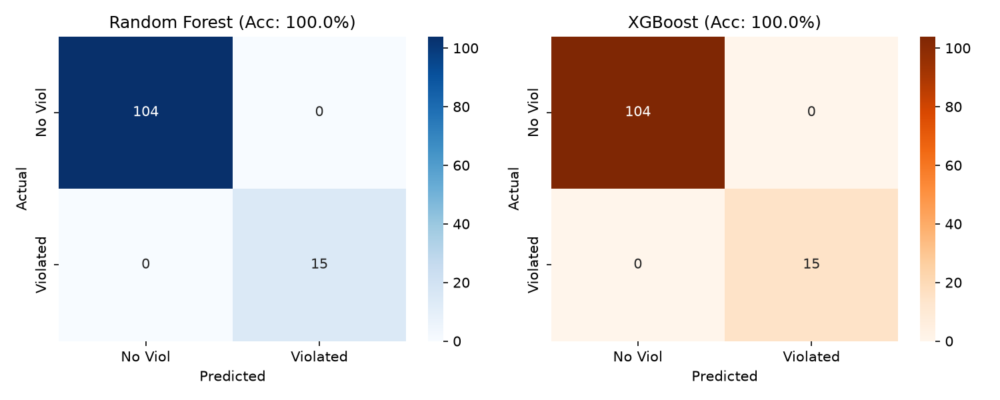

# ML-Based Setup Timing Violation Predictor

Predicts setup timing violations in RTL designs using Static Timing Analysis features and Machine Learning — before full placement & routing.

## Problem Statement

Timing closure is one of the biggest bottlenecks in VLSI physical design. Engineers typically only know whether a design meets timing after full P&R, which takes hours. This tool predicts setup timing violation risk right after synthesis, using ML trained on real STA data.

## Flow

RTL (Verilog) -> Yosys Synthesis -> OpenSTA Timing Analysis -> Feature Extraction -> ML Model -> Violation Prediction + Safe Clock Suggestion

## Dataset

- 5 designs: MAC unit, 8-bit ALU, 4-bit Multiplier, 8-bit Counter, Shift Register
- 580 configurations (clock period x input/output delay sweeps)
- PDK: Sky130 HD standard cell library
- Features: clock_period, input_delay, output_delay, cell_count, chip_area, WNS, TNS

## Models and Results

| Model | 5-Fold CV Accuracy | Test Accuracy |
|---|---|---|
| Logistic Regression | 98.3% | 100% |
| Random Forest | 99.8% | 100% |
| XGBoost | 100.0% | 100% |

5-fold cross validation confirms no overfitting. WNS deterministically derives from clock period, which is reflected consistently across all folds.

## Key Feature: Predict Any User Design

Run this command to test any Verilog design:

    python3 ml/predict_user_design.py rtl/mac_unit.v mac_unit 5.0 0.5 0.5

Arguments are: file path, module name, clock period, input delay, output delay.

Example output:

    STATUS        : TIMING VIOLATED
    SUGGESTION    : Use clock >= 6.5 ns

Successfully tested on 8+ unseen designs beyond the training set, including JK flip-flop, 4x1 MUX, 2x4 decoder, 4x2 encoder, AXI-Lite slave, and synchronous FIFO.

## Web Interface

A Streamlit app is included for interactive testing without using the terminal:

    streamlit run app.py

Upload any .v file, set clock and delay values, and get instant predictions with live timing-sweep visualization specific to that design.

## Add New Design to Dataset

    bash scripts/add_new_design.sh rtl/your_design.v your_module
    python3 ml/train_model.py

## Project Structure

    timing_predictor/
    |-- rtl/         RTL Verilog designs
    |-- scripts/     Yosys and OpenSTA automation scripts
    |-- dataset/     Generated timing dataset (CSV)
    |-- ml/          ML training, prediction, and visualization scripts
    |-- app.py       Streamlit web interface

## Tools Used

- Yosys 0.33 - Logic synthesis
- OpenSTA 2.7.0 - Static timing analysis
- Sky130 HD PDK - Standard cell library
- Python - pandas, scikit-learn, XGBoost, matplotlib, seaborn, Streamlit

## Visualizations

### Violation Probability Heatmap

### Model Comparison

### Feature Importance

### Confusion Matrix

