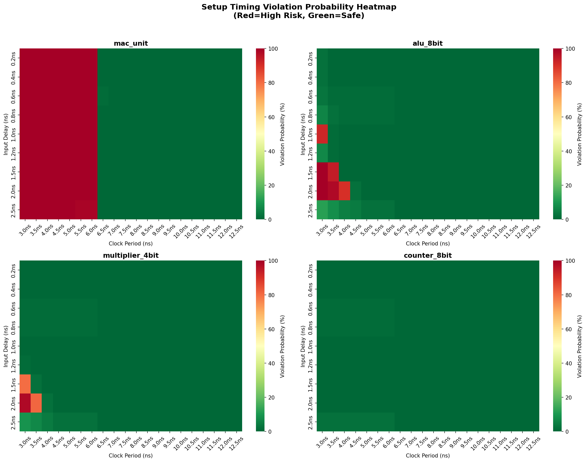
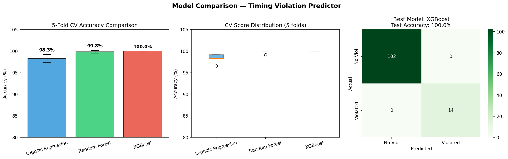
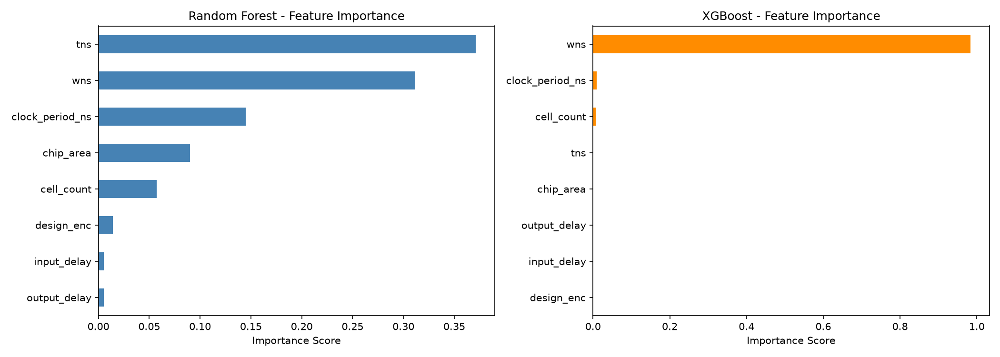

# ML-Based Setup Timing Violation Predictor

Predicts setup timing violations in RTL designs using Static Timing Analysis features and Machine Learning — before full P&R routing.

## Problem Statement
Timing closure is one of the biggest bottlenecks in VLSI physical design. This tool predicts whether a design will face setup timing violations at a given clock frequency — right after synthesis — saving hours of P&R iteration.

## Flow## Dataset
- 5 designs: MAC unit, 8-bit ALU, 4-bit Multiplier, 8-bit Counter, Shift Register
- 580 configurations (clock period × input delay variations)
- PDK: Sky130 HD standard cell library
- Features: clock_period, input_delay, cell_count, chip_area, WNS, TNS

## Models & Results
| Model | CV Accuracy | Test Accuracy |
|---|---|---|
| Logistic Regression | 98.3% | 100% |
| Random Forest | 99.8% | 100% |
| XGBoost | 100.0% | 100% |

5-fold cross validation used — no overfitting detected.

## Key Feature: Predict Any User Design
```bash
python3 ml/predict_user_design.py <your_design.v> <module_name> <clock_ns>
```
Example:
```bash
python3 ml/predict_user_design.py rtl/mac_unit.v mac_unit 5.0
```
Output:## Add New Design to Dataset
```bash
bash ml/add_new_design.sh rtl/your_design.v your_module
python3 ml/train_model.py
```

## Project Structure## Tools Used
- Yosys 0.33 — Logic synthesis
- OpenSTA 2.7.0 — Static timing analysis
- Sky130 HD PDK — Standard cell library
- Python — pandas, scikit-learn, XGBoost, matplotlib

## Visualizations
### Violation Probability Heatmap


### Model Comparison


### Feature Importance

